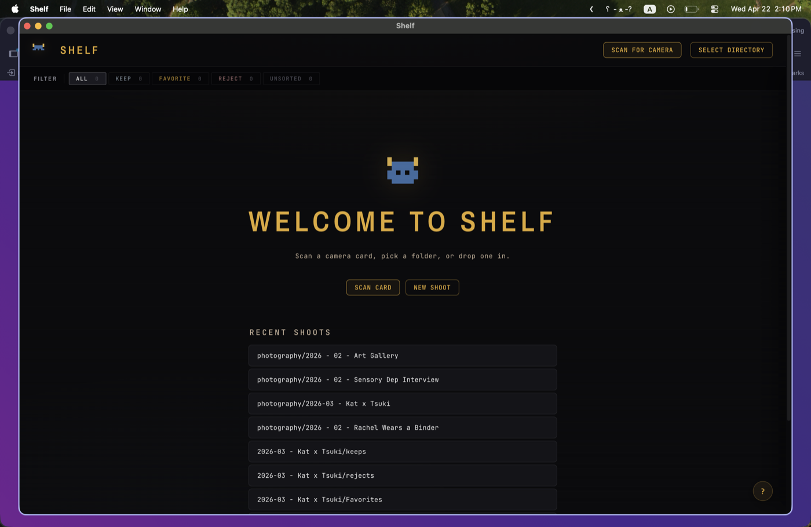
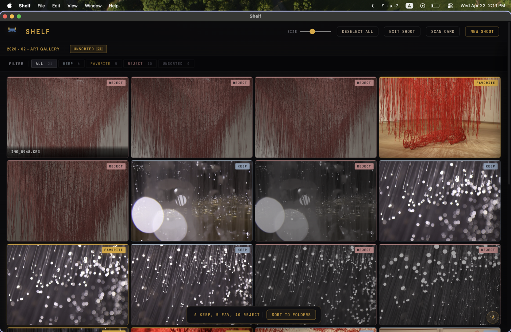
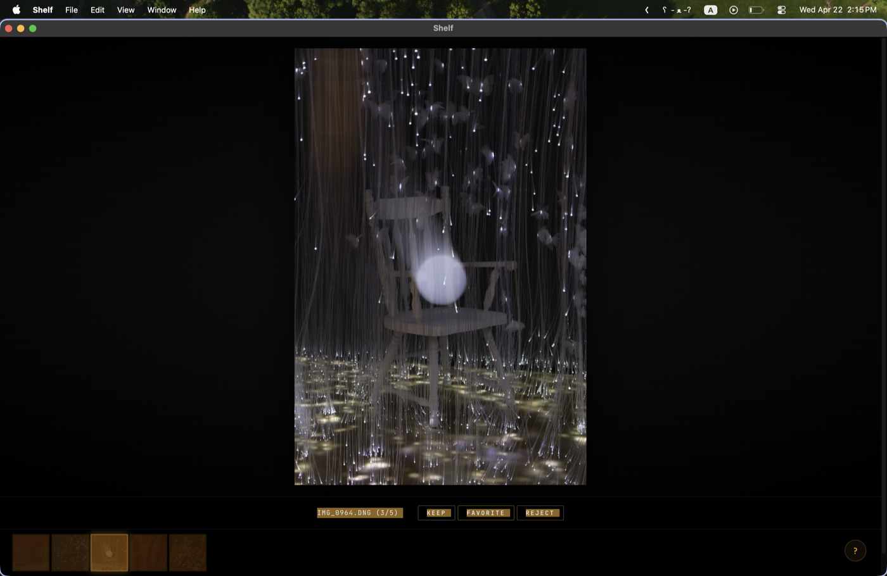
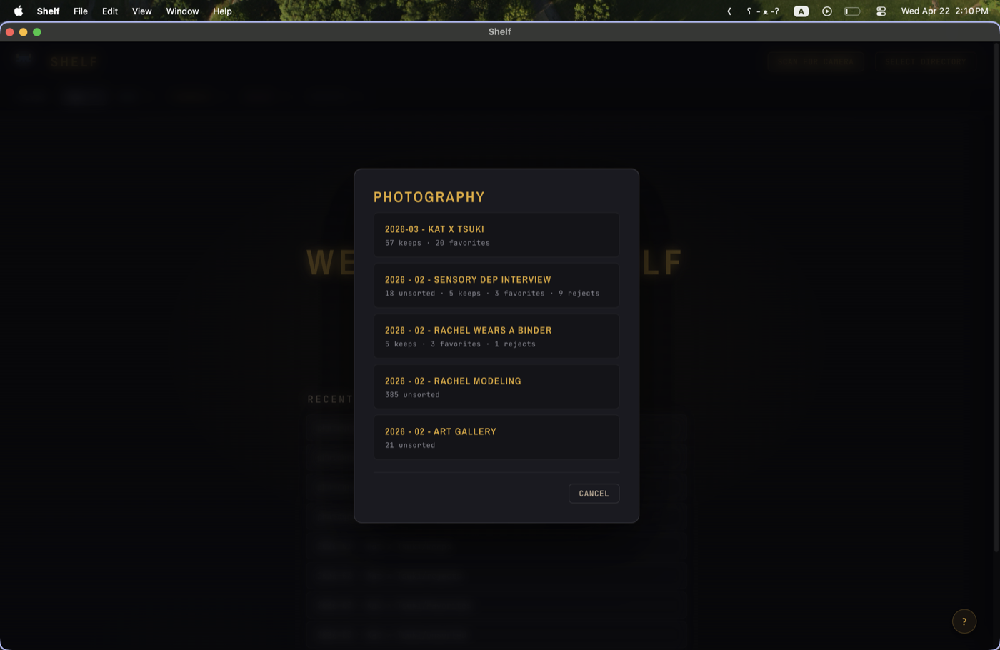
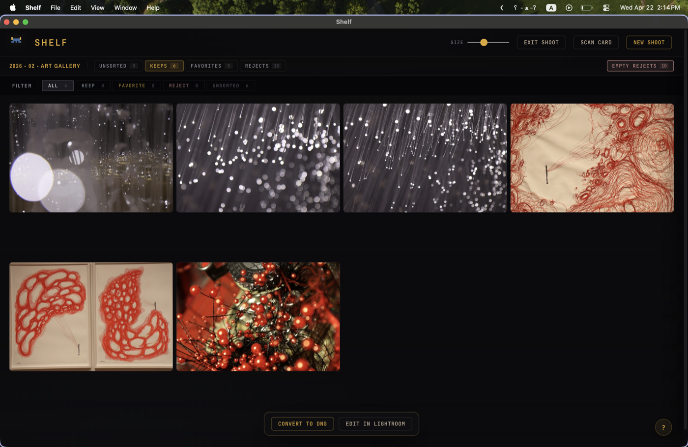

# Shelf 🪞

<p align="center">
  
</p>

<p align="center">
  <b>A cozy photo darkroom for sorting camera raws.</b><br/>
  <sub>Cull fast · Pick heroes · Hand off to Lightroom · Your filesystem is the database</sub>
</p>

<p align="center">
  <a href="https://github.com/servicedaemon/photography-shElf/releases/latest"></a>
  <a href="LICENSE"></a>
  
  
</p>

<p align="center">
  
</p>

<p align="center">
  
  
</p>

<p align="center">
  
  
</p>

<div align="center">
<pre>
              /\    /\
             /  \  /  \
            /____\/____\
            |  •    •  |
       ✦    |   \__/   |             ·
            \__________/
           ┌──────────────┐
           │              │
           │   ┌──────┐ ● │
           │   │  ◉   │   │
           │   └──────┘   │
           │              │
           └──────────────┘
</pre>
<sub><i>the elf, in monospace</i></sub>
</div>

---

## What Shelf is

Shelf is a small desktop app for the one thing photographers do every shoot but no tool feels quite right about: **culling**.

You plug in a card, press a key on each photo (keep / favorite / reject), and Shelf sorts them into real folders on disk. Then you pick heroes from your keeps, convert them to DNG, and hand them to Lightroom with one click. No catalog. No sync. No vendor lock-in. Every file stays visible in Finder, labeled by how you felt about it.

It is not a RAW developer — Lightroom (or Capture One, or Photoshop) is. It's the thing _before_ that, where 400 shots become 40, and 40 become 8.

**Built for one photographer, shared with love.** Personal tool energy. If that sounds like what you want, it's for you.

---

## ✨ Features

- **Three explicit stages** — `CULL` → `HEROES` → `FINAL`. Stage indicator in the header tells you where you are at a glance.
- **Dedicated marking keys** — `K` keep · `F` favorite · `X` reject · `U` unmark. Each auto-advances to the next unmarked photo.
- **Range selection** — Shift+click to select a range, then press a key to mark the whole run, or move them to a different shoot.
- **Sort to Folders** — creates a per-shoot folder under your library root with `unsorted/keeps/favorites/rejects` subfolders. Set the library root once via `File → Set Library Root…` (defaults to `~/Pictures/Shelf/`).
- **Sort in Place** — inside an existing shoot, sort routes leftovers into that shoot's existing folders, not a new bundle.
- **Shoot folder navigator** — chip row shows all siblings (Unsorted / Keeps / Favorites / Rejects / Edited) with counts; click to jump.
- **Move to Shoot** — select a range, move it to another shoot (existing or new), lands as `unsorted/`.
- **Empty Rejects** — one click moves reject photos to the system Trash. Recoverable until you empty it.
- **DNG conversion** — bundled `dnglab` support turns CR3/NEF/etc. into lossless DNG for Lightroom compatibility.
- **Edit in Lightroom** — one-click handoff opens your Favorites folder in Lightroom on macOS (or your file manager on Windows/Linux, drag from there).
- **EXIF inspector + tags** — sidebar shows camera, lens, exposure, lets you write keyword tags.
- **Stacks** — photos shot within 5 seconds of each other auto-cluster into stacks. Collapsed by default (scannability win at any scale). `S` expands/collapses one, `Shift+S` all. `P` promotes the focused frame as the stack cover. `G` / `Shift+G` jumps between stacks. `Shift+K/F/X/U` marks the whole stack and auto-advances past it — turns an N-frame burst cull from N keypresses into one.
- **Batch operations** — mark, tag, rotate all compose with the current selection (single photo, shift-click range, or collapsed stack). Tag sidebar shows "TAG APPLIES TO THIS STACK (5)" when the scope extends beyond one photo.
- **Rotation** — `⌥←` / `⌥→` rotates via EXIF orientation.
- **Drag-drop ingest** — drop a folder on the window, it loads instantly. Recent shoots on the welcome screen.
- **Native macOS feel** — real menu bar, dock icon, notifications on long operations, window-state persistence.
- **A reactive pixel elf mascot** — sparkles on favorites, blinks after rejects, holds the flashlight during conversions. 🌟

---

## 📥 Download

| Platform                  | File                    | Notes                        |
| ------------------------- | ----------------------- | ---------------------------- |
| **macOS (Apple Silicon)** | `Shelf-1.3.1-arm64.dmg` | Native for M-series Macs     |
| **Windows 10/11**         | `Shelf-Setup-1.3.1.exe` | NSIS installer, x64          |
| **Linux — AppImage**      | `Shelf-1.3.1.AppImage`  | Universal, no install needed |
| **Linux — Debian/Ubuntu** | `shelf_1.3.1_amd64.deb` | `sudo dpkg -i`               |

Latest release: **[GitHub Releases →](https://github.com/servicedaemon/photography-shElf/releases/latest)**

### Installing on macOS

> **Heads up:** Shelf isn't signed with an Apple Developer ID, so on first launch macOS will warn you that "Apple cannot check it for malicious software" or similar. The fix is one extra click — see step 3 below. After that, double-click works forever.

1. Download the DMG from the releases page.
2. Double-click to mount. Drag **Shelf.app** into `/Applications`.
3. **First launch**: in Finder, **right-click** (or Control-click) Shelf.app → **Open** → click **Open** in the dialog.
   _This is the standard "open an unsigned app" dance on macOS. You only do it once._
4. Optional for DNG conversion: `brew install dnglab` — only needed if you shoot CR3/CR2/ARW/NEF/RAF and want Lightroom-compatible DNGs. If you skip this, the Convert to DNG button will show a friendly modal with the install command when you click it.

<details>
<summary><b>If macOS says "Shelf is damaged and can't be opened"</b> (rare, Sequoia-aggressive case)</summary>

Open Terminal and run:

```bash
xattr -cr /Applications/Shelf.app
```

Then double-click again. This clears macOS's download-quarantine flag that's blocking launch. (We ad-hoc codesign the app in CI specifically to avoid this, but some macOS versions are more aggressive than others.)

</details>

### Installing on Windows

1. Download `Shelf-Setup-1.3.1.exe` from the releases page.
2. Double-click to run the installer. Follow the prompts.
3. **First launch**: Windows SmartScreen will warn _"Windows protected your PC."_
   Click **More info** → **Run anyway**. _This is needed once because the app isn't code-signed. After the first approval, double-click works forever._
4. Optional for DNG conversion: `choco install dnglab` (via [Chocolatey](https://chocolatey.org)) or download the binary from [dnglab releases](https://github.com/dnglab/dnglab/releases) and put it on your PATH.

**Windows known limitations:**

- **"Edit in Lightroom"** opens the Favorites folder in File Explorer instead of Lightroom directly. From there, drag the photos into Lightroom or use Lightroom's File → Add Photos. (On macOS, Lightroom auto-opens with the folder.)
- Config lives at `%APPDATA%\shelf\config.json` (not `~/.shelf`).

### Installing on Linux

**AppImage (any distro):**

1. Download `Shelf-1.3.1.AppImage` from the releases page.
2. `chmod +x Shelf-1.3.1.AppImage && ./Shelf-1.3.1.AppImage`
3. Most desktop environments let you double-click AppImages directly after marking executable.

> **If the AppImage fails with a FUSE error** on Ubuntu 24.04+, install the FUSE2 compatibility package: `sudo apt-get install libfuse2`. Or run it with `--no-sandbox` as a temporary workaround.

**Debian/Ubuntu (.deb):**

1. Download `shelf_1.3.1_amd64.deb` from the releases page.
2. `sudo dpkg -i shelf_1.3.1_amd64.deb`
3. Launch from your application menu or run `shelf` in a terminal.

Optional for DNG conversion: install `dnglab` from the [dnglab releases](https://github.com/dnglab/dnglab/releases) and put it on your PATH, or `cargo install dnglab` if you have Rust installed.

**Linux known limitations:**

- **"Edit in Lightroom"** opens the Favorites folder in your default file manager (xdg-open) — Lightroom doesn't exist on Linux. Drag the photos from there into your editor of choice (RawTherapee, darktable, etc.).
- Folder picker requires `zenity` (pre-installed on most GNOME-based distros). If it fails: `sudo apt-get install zenity`.
- Config lives at `~/.config/shelf/config.json`.

---

## ⌨️ Keyboard shortcuts

### Marking

| Key                      | Action             |
| ------------------------ | ------------------ |
| `K`                      | Keep + advance     |
| `F`                      | Favorite + advance |
| `X`                      | Reject + advance   |
| `U`                      | Unmark + advance   |
| Click                    | Toggle keep        |
| Double-click             | Toggle favorite    |
| `⌘`+Click                | Toggle reject      |
| Shift+Click, Shift+Click | Select range       |

### Navigation

| Key       | Action                    |
| --------- | ------------------------- |
| `← ↑ → ↓` | Move cursor               |
| `Space`   | Toggle preview (lightbox) |
| `⌥`+Click | Peek preview (hold)       |
| `⌥←` `⌥→` | Rotate image              |

### Panels

| Key   | Action                          |
| ----- | ------------------------------- |
| `I`   | Toggle EXIF sidebar             |
| `?`   | Keyboard shortcuts overlay      |
| `⌘Z`  | Undo last mark                  |
| `Esc` | Close overlay / clear selection |

---

## 🧭 Workflow walkthrough

```
1. Plug in SD card
   ↓  Scan Card   (or drag a folder onto the window)
2. Grid loads — stage: CULL
   ↓  K / F / X through photos
3. Click "Sort to Folders" — name the shoot once
   ↓  Bridge card appears
4. Click "Pick Heroes" — stage: HEROES
   ↓  F through keeps to pick your best
5. Click "Promote to Favorites" — stage: FINAL
   ↓  (optional) Convert to DNG
6. Click "Edit in Lightroom"
   ↓
7. Finish editing, export, done.
```

Total cull time for a 400-photo shoot: **~15 minutes** at a comfortable pace.

---

## 🏗️ Build from source

Requires **Node.js 20+** and **dnglab** (`brew install dnglab`).

```bash
git clone https://github.com/servicedaemon/photography-shElf.git
cd shelf
npm install

# Dev mode with hot reload
npm run electron:dev

# Package a macOS .dmg
npm run electron:build
# → dist-electron/Shelf-<version>-arm64.dmg
```

On a fresh machine, the first build also downloads the Electron binary (~100MB).

---

## 🎨 Design

Shelf's aesthetic is "darkroom + pixel workshop":

- **Deep black** base with an **amber safelight** accent (evokes a photographic darkroom)
- **Archivo Narrow** display serif paired with **JetBrains Mono** for everything else
- **Catppuccin Mocha** palette for status colors
- **Pixel elf mascot** (blue face, gold ears) that reacts to your actions
- Hairline borders, tabular numerics, uppercase tracked labels — feels like instrument chrome

Your filesystem is the database. Every operation is a visible folder move. A photographer 5 years from now can open the folder tree and understand the workflow without Shelf installed.

---

## 🛠️ Tech stack

- **Frontend**: Vite 6, vanilla JS ES modules (no framework)
- **Backend**: Express 5, child-process spawned inside Electron
- **Desktop shell**: Electron 33, electron-builder for packaging
- **Image**: `sharp` (thumbnails), `exiftool-vendored` (EXIF), `dnglab` CLI (DNG)
- **Tests**: Playwright E2E, Node's built-in `node:test` for server logic

No React. No Redux. No Tailwind. Just modules + events + CSS variables.

---

## 🐛 Troubleshooting

### "Shelf can't be opened because Apple cannot check it for malicious software"

First launch only. Right-click → Open → Open. This is because the app isn't code-signed.

### "Convert to DNG" is greyed out / returns 501

`dnglab` isn't installed or can't be found. Install it:

```bash
brew install dnglab
```

Shelf looks in `/opt/homebrew/bin/dnglab` (Apple Silicon) and `/usr/local/bin/dnglab` (Intel).

### Lightroom says "this folder doesn't contain any editable media"

Your Lightroom CC version doesn't recognize your camera's raw format. Use Shelf's **Convert to DNG** button — DNG is Adobe's universal raw format and will always open. (Especially common with brand-new camera bodies released within the last year.)

### (Windows) Thumbnails don't generate / EXIF reads silently fail

`exiftool-vendored` extracts a bundled executable to your temp directory on first run. Windows Defender occasionally flags this extraction and blocks it. If thumbnail generation isn't working:

1. Open **Windows Security** → **Virus & threat protection** → **Manage settings** → **Exclusions**
2. Add an exclusion for `%TEMP%\exiftool-vendored*` (or the folder Defender quarantined)
3. Relaunch Shelf

Symptom: photos load as placeholders/skeletons but never resolve to real thumbnails.

### Window opens off-screen after a display change

Disconnect → reconnect external displays. Shelf detects the change and clamps the window to your primary display on next launch. If it persists, delete `~/.shelf/config.json`.

---

## 🤝 Contributing

Shelf is personal-scale software but issues and PRs are welcome, especially:

- Bug reports (include OS + camera model + Shelf version)
- UI polish suggestions
- Camera format support gaps
- Performance issues on large shoots (2000+ photos)

---

## 📄 License

[MIT](LICENSE) — do whatever you want, include the notice.

---

## 💛 Credits

- Icon, aesthetic, and workflow design: [Ava Bellpepper](https://github.com/avabellpepper)
- Pixel elf character: [Ava Bellpepper](https://github.com/avabellpepper)
- Engineering collaboration: Claude (Anthropic)
- Catppuccin palette: the [Catppuccin community](https://catppuccin.com)
- DNG conversion: [dnglab](https://github.com/dnglab/dnglab)
- Raw metadata: [exiftool](https://exiftool.org)
- Fonts: [Archivo Narrow](https://fonts.google.com/specimen/Archivo+Narrow) by Omnibus Type, [JetBrains Mono](https://www.jetbrains.com/lp/mono/) by JetBrains

🍒 Made with cozy vibes.
